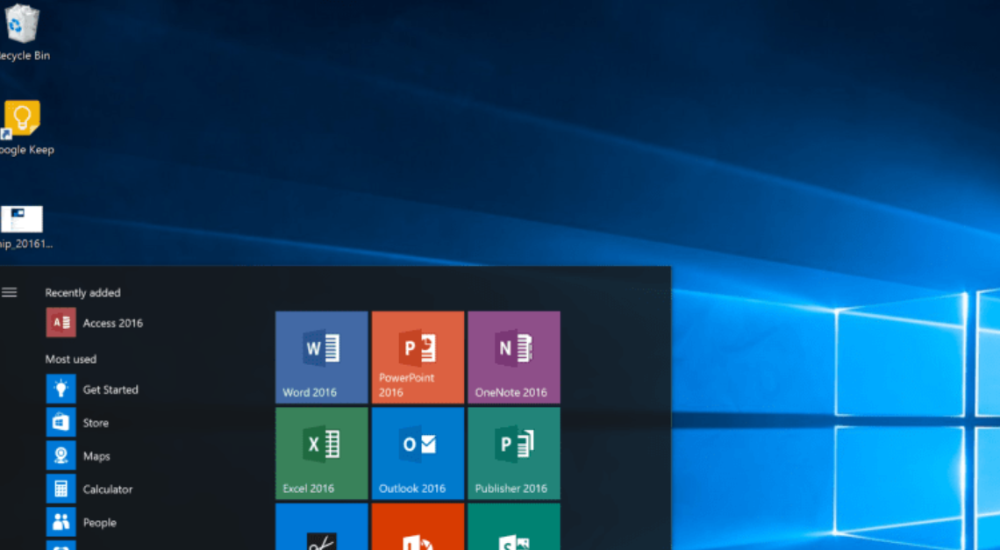
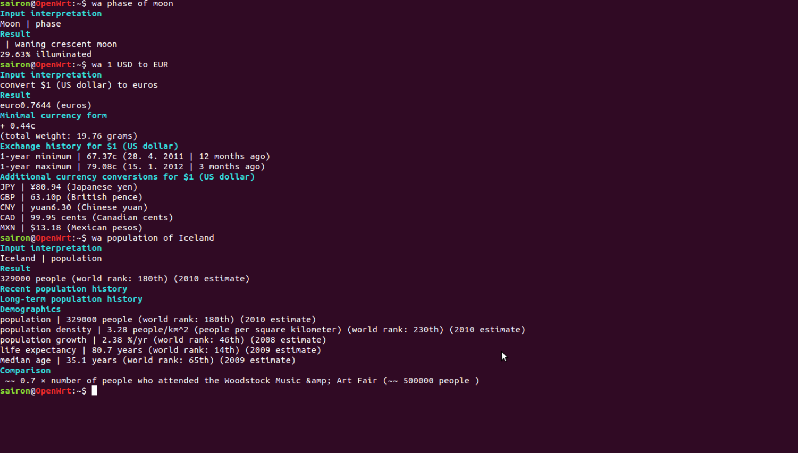
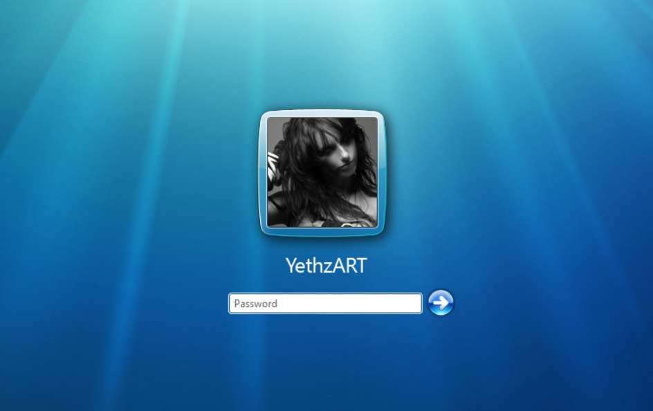

- UNIX基础知识

我们打开计算机后
通常进入一个图形界面

常用的程序或文件以图标的方式放在桌面上

使用程序的时候点击图标或进入程序列表菜单选择所需的程序

还有一种计算机没有绚丽的图形界面，它是早期的计算机操作系统

使用程序的时候需要输入程序的名字

这便是两种不同类型的计算机操作系统，一种是图形界面操作系统，一种是命令行界面操作系统。它们虽展示的界面不同，但本质都是相同的，都是为执行程序提供界面。

除了提供执行程序的界面，它们还包括以下的功能。

1. 登录

假如一台计算机需要多个人使用的话，则要给每个使用计算机的人创建单独的账号。当我要用到计算机时，则先要进行账号验证，才能登录而使用计算机。

2. 文件

存储文件到计算机是计算机的一项基本功能。

3. 网络

访问网络中的其它计算机也是一项基本功能。